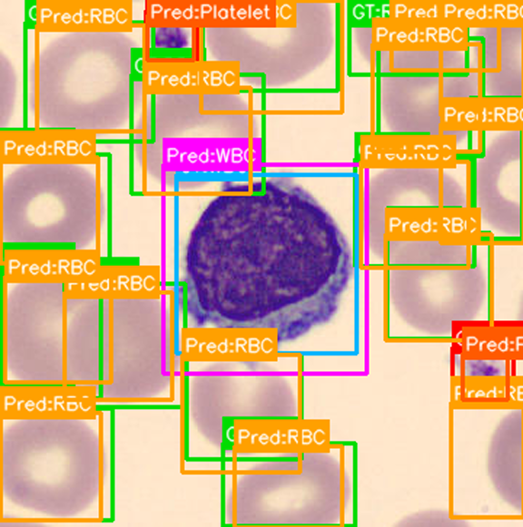
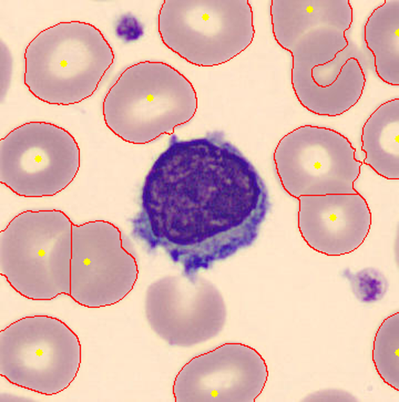
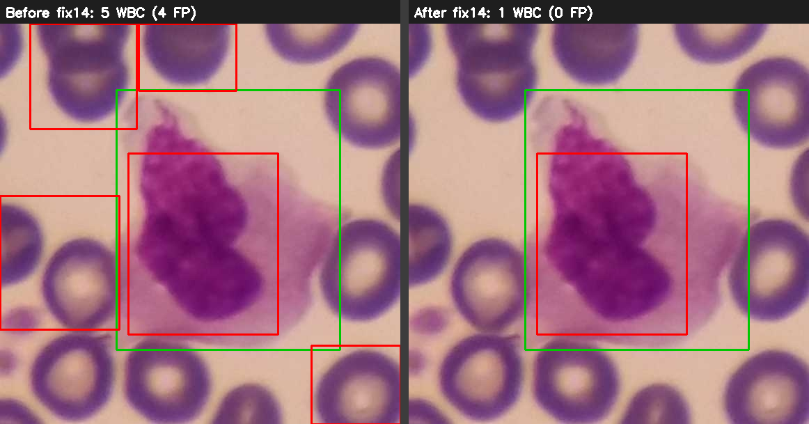

# 血液抹片細胞自動辨識與計數系統

> 影像處理 114-2 ｜ 期末專案

## 一、專案目標

綜合應用本學期所學的影像處理技術（空間域濾波、Adaptive Thresholding、形態學操作、輪廓分析），設計一個能自動處理血液抹片影像的互動式 App，將影像中的細胞與背景分離，並計算各類細胞的數量。

## 二、基本規定

| 項目 | 規定 |
| --- | --- |
| 作業形式 | 個人作業 |
| 資料集 | [TXL-PBC_Dataset（GitHub）](https://github.com/lugan113/TXL-PBC_Dataset) |
| 開發環境 | Python + OpenCV + Streamlit（建議使用 Google Colab） |
| 演算法限制 | 禁止使用深度學習（YOLO、CNN 等） |
| 繳交方式 | Colab 連結（或 `.ipynb` 檔案）+ 現場 Demo |
| Demo 時間 | 每人 3 分鐘 |
| 檔案上傳截止日期 | 第 16 週課程結束前（6/11 11:50 AM） |

請同學依以下指標為主作為演算法評分依據：
- Precision (精確率)：預測出來的結果中有多少是真的正確，其公式為 `TP/(TP+FP)`
- Recall (召回率)：所有 Ground Truth 中成功分辨出多少，其公式為 `TP/(TP+FN)`
- F1 score：比較平均的指標，公式為2PR/(P+R)

### 針對指標、參數與資料集說明

標註答案 (Ground Truth) 位於資料集的 `labels/` 目錄中，與 `images/` 的圖片檔名一一對應，其中資料格式經過正規化，已經將資料轉化為框，提供結果顯示與 IoU 計算、補全**邊界裁切**（把超出影像範圍的座標夾回 `[0, w]`／`[0, h]`），以下為本專案的實作：

```python
# YOLO 正規化 (類別, x中心, y中心, 寬, 高) → 像素框 [類別, x1, y1, x2, y2]
xmin = round((xc - bw / 2) * w)
ymin = round((yc - bh / 2) * h)
xmax = round((xc + bw / 2) * w)
ymax = round((yc + bh / 2) * h)
# 邊界裁切：夾回影像範圍，避免框超出邊界
xmin = max(0, min(xmin, w))
ymin = max(0, min(ymin, h))
xmax = max(0, min(xmax, w))
ymax = max(0, min(ymax, h))
```

> 節錄自 `eval_iou.py` 的 `load_yolo_gt_clipped()`。

IoU：面積交集/面積聯集，程式判斷後須轉化成方框，與資料集的面積進行計算，得出分數，作為是否判斷成功之依據，以下為本專案的實作：

```python
def iou(box_a: Box, box_b: Box) -> float:
    # 交集矩形的左上 / 右下角
    x_left = max(box_a[1], box_b[1])
    y_top = max(box_a[2], box_b[2])
    x_right = min(box_a[3], box_b[3])
    y_bottom = min(box_a[4], box_b[4])
    # 交集寬高（不重疊時夾為 0）
    iw = max(0.0, x_right - x_left)
    ih = max(0.0, y_bottom - y_top)
    inter = iw * ih
    # 各自框的面積
    area_a = (box_a[3] - box_a[1]) * (box_a[4] - box_a[2])
    area_b = (box_b[3] - box_b[1]) * (box_b[4] - box_b[2])
    # 聯集面積 = 兩框面積和 − 交集
    union = area_a + area_b - inter
    return inter / union if union > 0 else 0.0
```

> 節錄自 `eval_iou.py` 的 `iou()`，方框格式為 `[類別, x1, y1, x2, y2]`，故座標索引由 1 起算。

採用**貪婪一對一配對** (truth-prediction)，把所有「同類別且 IoU 達閾值(自訂)」的候選對收集後，依 IoU 由高到低逐對配，每個預測框與每個答案框都只能用一次；配成功的對數即 TP，多餘的預測算 FP、沒配上的答案算 FN：

```python
def match_one_to_one(preds, gts, thr):
    # 收集所有「同類別且 IoU ≥ 閾值」的候選配對
    pairs = []
    for pi, p in enumerate(preds):
        for gi, g in enumerate(gts):
            if int(p[0]) != int(g[0]):    # 類別不同 → 不可配對
                continue
            score = iou(p, g)
            if score >= thr:              # IoU 須達自訂閾值 (0.3 / 0.5)
                pairs.append((score, pi, gi))
    pairs.sort(reverse=True)              # 依 IoU 由高到低，最佳配對優先
    used_p, used_g = set(), set()
    tp = 0
    for score, pi, gi in pairs:
        if pi in used_p or gi in used_g:  # 一對一：兩邊各只能用一次
            continue
        used_p.add(pi)
        used_g.add(gi)
        tp += 1
    fp = len(preds) - tp                  # 多餘的預測 → 誤報
    fn = len(gts) - tp                    # 沒配上的答案 → 漏報
    return tp, fp, fn
```

> 節錄自 `eval_iou.py` 的 `match_one_to_one()`。實際評估時外層先依類別分組再呼叫此函式，函式內的同類別檢查為雙重保險（見下方「評估與配對規則」章節）。

## 三、評分標準

### ▌ 基本要求（必做）— 60 分

| 評分項目 | 說明 | 配分 |
| --- | --- | --- |
| 影像前處理 Pipeline | 灰階、Gaussian Blur、Adaptive Thresholding、Morphological Closing，各階段於 App 中可視化 | 15 分 |
| 細胞偵測與計數 | 至少正確偵測 1 種細胞（白血球為基本要求）<br>1. 誤差 ±30% 內 → 25 分<br>2. 誤差 ±50% 內 → 13 分<br>3. 誤差超過 50% → 0 分 | 25 分 |
| Streamlit App UI | 圖片切換功能、至少 1 個可調參數、各階段結果顯示、下載按鈕 | 10 分 |
| 程式碼品質 | 模組結構清楚、關鍵步驟有中文或英文註解 | 10 分 |

### ▌ 加分挑戰（選做）— 最多 +40 分

| 加分項目 | 說明 | 加分 |
| --- | --- | --- |
| 三種細胞分類 | 以面積 + 圓形度規則分類 RBC / WBC / 血小板並各自計數，每種誤差 ±30% 內 | +15 分 |
| 重疊細胞切分（Watershed） | 使用 Watershed + Distance Transform 成功分離相鄰或重疊的細胞 | +15 分 |
| 5 張圖通用 | 固定參數，在 5 張不同測試圖上不手動調整即可正常運作 | +5 分 |
| 書面報告 | PDF 格式：Pipeline 架構圖、演算法說明、實驗結果表、困難案例分析 | +10 分 |

## 四、分數段對應表現

| 分數 | 對應完成程度 |
| --- | --- |
| 60 分 | 完成前處理 + 各類計數 + 基本 UI，能 Demo |
| 75 分 | 另完成三種細胞分類（面積 + 圓形度規則） |
| 90 分 | 加上 Watershed 切分重疊細胞 |
| 95+ 分 | 再加書面報告 + 5 張圖通用 |

## 五、Demo 與口試說明

每人 3 分鐘，包含：

- 上傳一張血液抹片影像，展示完整處理流程
- 說明設計決策（「為什麼選這個方法」，不只是「我做了什麼」）
- 助教會從問題中了解你對整個 work 的了解有多少

## 實作想法

目前版本採用「面積 + 圓形度 + 顏色 + 紋理規則」完成可解釋的傳統影像處理 pipeline，**全程不使用任何深度學習，也不依賴任何訓練模型**。三種細胞各自設計獨立的偵測器，再由 `detect_cells()` 統一輸出方框。完整的設計決策（「為什麼選這個方法」）與優化歷程記錄在 [`report.md`](report.md)。

### 專案結構

| 檔案 | 職責 |
| --- | --- |
| `blood_cell_detector.py` | 核心模組：前處理 pipeline、WBC/RBC/PLT 偵測器、Watershed、計數與繪圖工具 |
| `app.py` | Streamlit App：圖片切換、可調參數、各階段視覺化、GT/預測對照、下載按鈕 |
| `eval_iou.py` | 批次評估腳本：依助教指定的 **IoU 配對法**計算 TP/FP/FN 與 Precision/Recall/F1 |
| `TXL_PBC_Streamlit_Colab.ipynb` | 自包含 Colab notebook：`%%writefile` 寫出程式、git clone 資料集、啟動 App |

### 解析度自適應的尺度基準

所有規則閾值都不是寫死的像素值，而是以**估計的 RBC 半徑 `r0`** 為基準動態縮放（`shape_rbc_radius()`）。`r0` 僅由影像長寬推得（如 575×575 → 65px），不偷看標註答案。如此一來面積、邊界框、最小間距等門檻都能隨影像解析度自動調整，達成「固定參數、多張圖通用」。

### 前處理 Pipeline（`preprocess_pipeline()`）

對應評分項目「影像前處理 Pipeline」，每一階段都在 App 中以圖卡呈現：

```
輸入影像 (BGR)
    ├─ 1. 灰階  cvtColor(BGR2GRAY)
    ├─ 2. Gaussian Blur  高斯模糊去除雜訊（kernel 可調）
    ├─ 3. Adaptive Thresholding  自適應二值化（block size 由 r0 推算，THRESH_BINARY_INV）
    ├─ 4. Morphological Closing  閉運算填補細胞內部破洞
    ├─ 5. Opening Cleanup  開運算清除細小雜點
    ├─ 6. Purple Mask  紫色染色遮罩（供 WBC/PLT 使用）
    └─ 7. Watershed + Distance Transform  重疊細胞切分視覺化
```

### 紫色染色遮罩（關鍵共用元件）

WBC 與血小板的細胞核都被染成紫色，是與粉紅色 RBC 最可靠的區隔。遮罩同時結合 **HSV** 與 **LAB** 兩個色彩空間（`A>145` 偏紅、`B<125` 偏藍 → 紫色），比單一 HSV 更穩定：

- `purple_mask_strict()`：高精確率（深紫才保留），用於「把 RBC 排除在紫色區外」與 Watershed／視覺化。B 門檻**隨整張影像自適應**（`B < min(115, B_median−18)`）：偏紫抹片上紅血球的 B 值也會偏低，固定門檻會把它們當紫色誤排除，自適應後只影響偏紫片、找回約 90 顆 RBC，正常片行為不變（見 report.md「修正 13」）。
- `purple_mask_loose()`：高召回率，用於血小板候選抽取（寧可多抓再用規則過濾）。

### 三種細胞偵測策略（WBC 最先執行，其框用來排除 RBC/血小板）

**WBC（`detect_wbc`）**
**violet-hue 遮罩**（hue 120–158、S≥70、V<232、A>132、B<128；`wbc_violet_mask`）→ 形態學**開運算**取出實心核 → 小幅膨脹只合併同一核的分葉 → 連通元件 → 幾何（夠大 > 1.05·r0）規則 → **核心深染驗證**（核心區飽和度中位數 ≥ 100 或 LAB-B ≤ 102）→ **尺寸下限**（最長邊 ≥ 1.6·r0，砍掉偏紫片上的小紫斑）→ **相對飽和度閘**（核心飽和度須高出整張影像中位數 ≥ 60，已深藍 B ≤ 102 者豁免；偏紫片上被暈染帶起的淡紫斑差值僅 ~44 → 丟棄）→ **過大候選的相對飽和度閘**（邊長 ≥ 4.5·r0 者門檻拉到 ≥ 70）→ 中心距離 NMS（半徑 1.8·r0，把碎裂分葉併成單框）。框取核心外接框（GT ≈ 1.03×核外接框，只加極小 padding）。用窄 hue 鎖定真紫色，連淡染核都抓得到；相對飽和度閘把「絕對飽和度看似夠、其實只是整片底色偏紫」的假核擋掉（修正 14：FP 77→28、召回不變、F1 0.93→0.95）。**偵測完的 WBC 框會傳給 RBC 與血小板偵測器，排除中心落在 WBC 框內的候選**，白血球就不會被切成紅血球或血小板。

**RBC（`detect_rbc_rule`）**
取前處理後的二值圖 → `findContours`（`RETR_LIST`）抽輪廓 → 用**面積、邊界框尺寸、長寬比、圓形度**四道規則篩選（圓形度 `4πA/P²`），並排除落在紫色區內的輪廓（避免把 WBC 算成 RBC）→ **包含抑制**（當更細的單顆框中心落在某團塊框的**中央 80%** 內，丟掉該團塊框，避免一顆細胞被框兩次；用中央 80% 而非整框，以免邊緣相鄰的獨立細胞被誤刪）→ 中心距離 NMS。`RETR_LIST` 的內孔輪廓本身即可把黏連團塊切成單顆（保留召回）；因 RBC 大小極一致（GT 邊長 ≈ 2·r0），框半徑往 `r0` 收斂、再 **×1.13 校正**（暗環輪廓比 GT 框小 ~11%，補回後 IoU 0.5 明顯提升）以提升 IoU。最後再用 **Hough 圓偵測**（`hough_rbc_candidates`，固定半徑先驗）補回「相連／環不完整、輪廓抓不到」的紅血球，召回率 0.82→0.86、F1 0.79→0.80（見 [`report.md`](report.md) 修正 11）。

**血小板（`detect_platelets_rule`，純規則）**
寬鬆紫色遮罩取小面積連通元件 → 抽取手工特徵 → **雙分支接受規則**：（A）強染顆粒——用**顆粒紋理**（飽和度變異 `S_std`、灰階變異 `gray_std`）作主判據，配合顏色（`S_mean`、`B_mean`）與面積門檻；（B）淡染但圓——染色較淡（`S_mean≥60`）但形狀夠圓（`circ≥0.68`）且偏紫（`B_mean≤112`）的真血小板（救回約 ¼ 漏抓的淡染血小板，見 report.md「修正 12」）→ 任一分支通過即收 → 排除中心落在**加 0.10·r0 margin 的 WBC 框**內的候選（去掉白血球邊緣的假血小板）。真血小板內部有顆粒造成明顯亮度起伏，背景紫色雜訊則均勻，紋理是最乾淨的分界；淡染的真血小板雖然飽和度低、卻仍然圓，故以圓形度補抓。框設成固定大小以對齊一致的血小板 GT。

### Watershed + Distance Transform（加分項）

`watershed_rbc_candidates()` / `watershed_visualization()` 針對相鄰、重疊的 RBC：關鍵是先用 **fill-holes 前景**（`rbc_filled_foreground`，把暗膜環填實成實心圓盤；直接用顏色當前景會在偏色抹片淹掉全圖 ~94%），再以 Distance Transform 局部峰值（`peak_local_max`）作種子、Watershed 沿距離谷底切開黏合邊界，於 App 以紅線疊圖顯示。App 提供勾選框可把 Watershed 候選補進計數，但**預設關閉**——量測顯示純 Watershed 補計數會帶進約 4.7 倍假陽性（精確率 0.75→0.66、計數超 ±30%）。因此 Watershed 作為**重疊細胞的視覺化展示（加分項）**，實際計數的相連細胞召回改由 **Hough 圓偵測**負責（圓形 + 固定半徑先驗比 blob 先驗更能分辨真假，召回 0.82→0.86 而精確率幾乎不變）。

### 評估與配對規則（`eval_iou.py`）

依公告要求以 **IoU 配對**計算指標。每張影像的完整計算鏈如下：

1. **讀取答案框**（`load_yolo_gt_clipped`）：YOLO 正規化標註 → 像素座標框 `[類別, x1, y1, x2, y2]`，並做**邊界裁切**（超出影像範圍的座標夾回邊緣）。
2. **產生預測框**（`detect_cells`）：對影像跑一次偵測器，輸出同格式的預測框。
3. **同類別分組**：把預測框與答案框各依類別（0=WBC、1=RBC、2=Platelet）分開，**只在同類別之間配對**——WBC 的預測永遠不會配到 RBC 的答案；類別不同即使框重疊也不算 TP。
4. **算 IoU**（`iou`）：對每一對「同類的 pred–GT」計算重疊度
   `IoU = 兩框交集面積 / 兩框聯集面積`（注意 IoU 是「一對框之間」的關係，不是單一框自己的面積）。
5. **一對一貪婪配對**（`match_one_to_one`）：收集所有 IoU ≥ 閾值的 (pred, gt) 候選對，**依 IoU 由高到低排序**，從最高分開始配，每個預測框與每個答案框都只能用一次。配對成功的對數即 **TP**。
6. **歸類剩餘框**：
   - 沒配到的**預測框** → **FP**（誤報：偵測到但無對應答案），`FP = 預測總數 − TP`
   - 沒配到的**答案框** → **FN**（漏報：答案存在卻沒偵測到），`FN = 答案總數 − TP`
7. **計算指標**：`Precision = TP/(TP+FP)`、`Recall = TP/(TP+FN)`、`F1 = 2PR/(P+R)`。每類各算一組，再把三類的 TP/FP/FN 加總算 **micro** 平均（整體表現）。

整套評估會在 **IoU 閾值 0.3**（主要，框抓到大致位置即算對）與 **0.5**（較嚴格，框要貼得更準）各跑一次。

> **關於貪婪配對的公正性**：貪婪「IoU 高的先配」不保證**全域最佳**（理論上在多框搶同一目標的密集重疊角落案例，可能比匈牙利演算法少算 1 個 TP），但它是 COCO／Pascal VOC 同款的標準慣例，偏差對稱且量級可忽略，對「比較不同方法」一視同仁，故維持此規格。多餘預測一律計 FP、漏抓答案一律計 FN，也無法靠「狂噴框」灌高分數。

```bash
python eval_iou.py --split test --iou 0.3 --mode rule
```

### Streamlit App 功能（`app.py`）

對應「Streamlit App UI」評分項目：
- **圖片切換**：側欄選擇 split 與影像。
- **可調參數**：Gaussian kernel、adaptive block ratio、adaptive C、closing kernel、RBC/PLT 圓形度門檻、Watershed 開關。
- **各階段顯示**：前處理 7 階段圖卡、GT 與預測雙欄對照、計數誤差表（±30%/±50% PASS/FAIL）。
- **下載按鈕**：預測疊圖 PNG、預測框 CSV、計數誤差 CSV。

### 成果（IoU 0.3，純規則模式）

| 細胞 | Test F1 | Val F1 | 全資料集 F1 | 計數誤差(test) |
| --- | --- | --- | --- | --- |
| WBC | 0.96 | 0.95 | 0.95 | −3.0% |
| RBC | 0.81 | 0.79 | 0.80 | +17.4% |
| Platelet | 0.72 | 0.77 | 0.71 | +22.4% |
| **micro** | **0.81** | **0.80** | **0.81** | — |

WBC 在 IoU 0.3 下 F1 達 ~0.95（精確率 ~0.98，經修正 14 的相對飽和度／尺寸閘把假陽性 77→28、召回不變），RBC 經 Hough 圓偵測補強與自適應紫色排除後召回率 ~0.87、F1 ~0.80，三類細胞計數誤差皆在 **±30%** 內，且 test/val/全資料集一致（未過擬合）。經框大小校正後 **IoU 0.5 下 micro F1 亦達 ~0.78**（WBC 0.89、RBC 0.78），0.3 與 0.5 落差僅 ~0.03，框不靠寬鬆閾值也夠準。完整優化歷程（含偏紫抹片白血球框、框大小校正、Watershed 前景修正、Hough 相連細胞補強、自適應紫色排除與白血球假陽性清除）見 [`report.md`](report.md)。

## Demo 指南（3 分鐘口試）

`demo/` 內附三張參考輸出圖（從下列資料集影像產生），demo 時於 App 側欄選對應 split／影像即可重現。

### 主圖（偵測 + 計數 + Watershed 一張走完）
**`val / 725736c0a7ea5b9693dbb031efa3cd23.png`** — 三類都乾淨：WBC 1/1、血小板 2/2 全中、RBC 14→16（僅 2 FP、漏抓 0），且相連細胞中等密度、Watershed 切得乾淨。

| 偵測（GT 綠 / 預測）：`demo/detection_725736c0.png` | Watershed 切分：`demo/watershed_725736c0.png` |
| --- | --- |
|  |  |

### Watershed 密集場面（加分項展示）
**`test / 13cd097a957e573b84aee503a173dd94.png`** — 相連紅血球多、紅線切分明顯，左下白血球正確未被切成紅血球。見 `demo/watershed_13cd097a.png`。
> ⚠️ 這張**只適合展示 Watershed 切分**，不適合當偵測 demo：它的紅血球輪廓偵測剛好偏過切（多 FP），且有一顆**淡染血小板**（飽和度過低）抓不到——屬已知的「54:1 雜訊牆」極限。

### Demo 流程與講解重點
1. 選主圖 `725736c0`，展示前處理 1–8 階段圖卡（灰階→模糊→二值化→形態學）。
2. 並排看 GT 與預測框、計數誤差表（三類皆 PASS ±30%）。
3. **打開 Watershed 開關**，指階段 8：「先把紅血球暗膜環 **fill-holes** 填成實心圓盤 → Distance Transform，每顆中心是局部峰值（黃點）→ Watershed 沿距離谷底切開（紅線）。」
4. 設計深度（口試常問）：
   - **Watershed 為何不併入計數**：實測補計數會帶進約 4.7× 假陽性（精確率 0.75→0.66、計數超 ±30%），故相連細胞召回改用 **Hough 圓偵測**（圓形+固定半徑先驗比 blob 先驗更能分辨真假）——Watershed 作視覺化加分項。
   - **三類分類**：以**面積 + 圓形度為核心規則**並各自計數（皆 ±30%）；因實測單靠面積+圓形度分不開（血小板雜訊 54:1、白血球與紅血球團幾何重疊），故輔以顏色／紋理補足。
   - **全程不使用深度學習、不依賴任何訓練模型**。

### 困難案例分析圖（`demo/cases/`，供書面報告引用）
| 圖檔 | 對應修正 | 說明 |
| --- | --- | --- |
| `case7_violet_wbc_66c07dae.png` | 修正 7 | 整張偏紫抹片：**前**白血球框爆成整張圖→紅血球全被排除；**後**過大候選的相對飽和度閘擋下染色假象→紅血球找回 |
| `case11_hough_969b2db8.png` | 修正 11 | 相連紅血球：**前**輪廓偵測漏抓（紅框）；**後**Hough 圓偵測補回（FN 9→4） |
| `case14_wbc_fp_5c714f32.png` | 修正 14 | 整張偏紫抹片：**前**真白血球周圍 4 顆被暈染帶紫的紅血球被誤判成白血球（5 框、4 FP）；**後**相對飽和度／尺寸閘擋下淡紫假核（1 框、0 FP，召回不變） |
| `case_watershed_mechanism.png` | 加分項 | Watershed 四步驟：原圖→fill-holes 實心前景→Distance Transform 峰值→紅線切分 |



完整 14 項修正歷程與資料驅動的判斷（含「為什麼不那樣做」）見 [`report.md`](report.md)。

