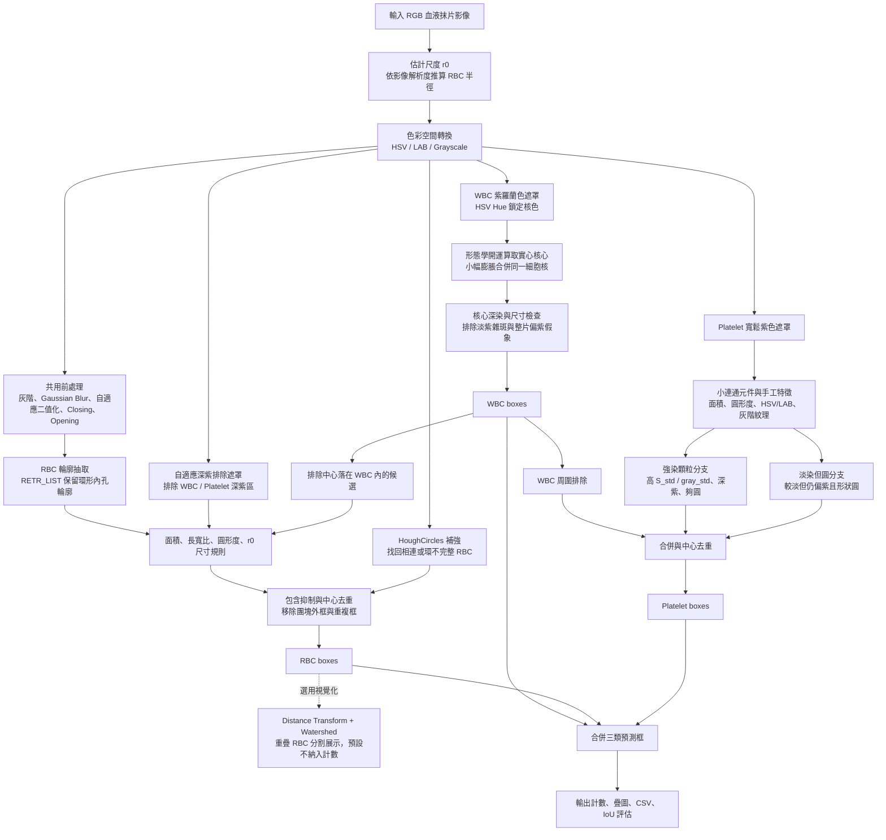

# TXL-PBC 血液抹片細胞偵測報告

> 影像處理 114-2 ｜ 期末專案書面報告  
> 本專案以傳統影像處理完成 WBC、RBC 與 Platelet 偵測與計數，不使用深度學習，也不依賴訓練模型。

本報告對應目前程式碼版本：`blood_cell_detector.py`、`app.py`、`eval_iou.py`。評估方式依助教指定的 IoU 規格：YOLO 標註轉為像素框，預測框與 GT 框必須同類別且 IoU 達門檻，才以一對一貪婪配對計為 TP。

---

## 一、設計總覽

整體做法是先把最容易和其他細胞混在一起的白血球抓出來，再偵測紅血球與血小板。白血球的紫色細胞核很明顯，如果不先處理，後續的輪廓偵測容易把白血球切成好幾顆紅血球或血小板。

三種細胞採用不同線索：

| 細胞 | 主要線索 | 設計理由 |
|------|----------|----------|
| WBC | 紫羅蘭色細胞核、深染核心、尺寸較大 | 白血球核顏色最特殊，先抓出來可避免被其他類別重複計算 |
| RBC | 圓形輪廓、穩定半徑、Hough 圓補強 | 紅血球數量多且大小一致，顏色受染色影響較大，幾何特徵更可靠 |
| Platelet | 小型紫色元件、顆粒紋理、圓形度 | 血小板很小且常像雜訊，必須用內部紋理與形狀排除假紫點 |

所有尺寸門檻都使用 `shape_rbc_radius()` 依影像解析度估計出的紅血球半徑 `r0`。這個 `r0` 不使用標註答案，只讓同一套規則能隨影像大小縮放。

---

## 二、Pipeline 架構



---

## 三、三種細胞偵測：方法與設計決策

### 3.1 偵測方式簡述

這個專案不是用模型「學」出細胞，而是把影像中人眼能分辨的線索轉成規則。

白血球先看「有沒有真正偏紫羅蘭色的大細胞核」。紅血球主要看「是不是接近圓形，而且大小像一顆紅血球」。血小板則看「是不是小小的紫色顆粒，而且內部不像平滑雜訊」。三者都會輸出同樣格式的 bounding box，最後再合併計數。

### 3.2 影像前處理

前處理的目標不是把所有細胞一次分完，而是提供穩定的候選區域與輔助遮罩。

1. **灰階與 Gaussian Blur**：先降低細小雜訊，讓後續二值化不會被單點雜訊干擾。
2. **自適應二值化**：血液抹片亮度不均，固定 threshold 容易失效；自適應二值化會依局部亮度抓出暗色細胞膜與邊界。
3. **Closing 與 Opening**：Closing 補細胞膜的小缺口，Opening 去掉零散小點，讓輪廓更乾淨。
4. **HSV / LAB 色彩轉換**：HSV 用來鎖定紫色 hue 與飽和度，LAB 的 B 通道用來分辨深紫核與偏粉紅的紅血球。
5. **紫色遮罩**：白血球、血小板需要紫色資訊；紅血球偵測則用較嚴格且會隨整張影像色偏調整的紫色遮罩，避免把深紫區誤算成紅血球。
6. **Watershed 視覺化前景**：紅血球是暗膜環，會先把環形前景填成實心區域，再做 Distance Transform 與 Watershed，作為重疊細胞切分展示。

### 3.3 WBC 白血球偵測

白血球最先偵測，核心依據是細胞核的紫羅蘭色。

程式先建立 `wbc_violet_mask()`：鎖定 HSV hue 120-158，同時搭配 LAB A/B 與亮度限制。這樣能抓到真正偏紫的白血球核，也能避開大部分偏粉紅的紅血球團。

得到紫色遮罩後，流程如下：

1. 用較大的形態學開運算只留下實心細胞核核心，去掉邊緣紫色細線與小斑點。
2. 用小幅膨脹把同一顆白血球核的碎裂葉片合併。
3. 對連通元件檢查面積與幾何尺寸，排除血小板大小的紫點。
4. 檢查核心是否夠深染：飽和度中位數夠高，或 LAB-B 夠低。
5. 對整張偏紫的影像，再用「核心飽和度相對全圖飽和度」判斷，避免大片淡紫背景被框成白血球。
6. 將核心外接框加少量 padding，並用中心距離合併同一顆白血球的重複框。

WBC 框會傳給 RBC 與 Platelet 偵測器；後兩者若候選中心落在 WBC 框內，就不採用。

### 3.4 RBC 紅血球偵測

紅血球的顏色會因染色與亮度改變而不穩定，所以主要依靠形狀與尺寸。

基本輪廓流程使用共用前處理後的二值圖，透過 `cv2.findContours(..., RETR_LIST, ...)` 抽輪廓。使用 `RETR_LIST` 的原因是紅血球常呈環狀，內孔輪廓本身可以幫忙把黏在一起的細胞拆成單顆候選。每個候選會通過以下檢查：

1. 面積要接近紅血球可能範圍。
2. 寬高與長寬比不能太誇張。
3. 圓形度不能太低。
4. 中心不能落在深紫遮罩或 WBC 框內。
5. 方框大小以 `r0` 校正，因為紅血球標註框大小非常一致。

輪廓偵測會產生兩類多餘框：一種是包住多顆細胞的團塊外框，另一種是密集區中落在細胞縫隙的重複框。程式用包含抑制與尺寸感知中心去重處理：優先保留邊長接近 `2*r0` 的單顆紅血球框。

為了補回相連或邊界不完整的紅血球，預設再加上 `cv2.HoughCircles()`。Hough 圓偵測利用「紅血球半徑穩定且近圓」這個先驗，即使只有一段弧線，也可能投票出完整圓。Hough 候選會與輪廓候選合併，再進行中心去重。

Watershed 也有實作，但預設只作為 App 的重疊細胞視覺化。實測把 Watershed 候選直接併入計數會帶入過多假陽性，因此最終計數以輪廓加 Hough 為主。

### 3.5 Platelet 血小板偵測

血小板小、數量少，又容易和紫色雜訊混在一起，因此只看面積或顏色不夠。最終規則先用寬鬆紫色遮罩找出小型連通元件，再對每個元件抽手工特徵，包括面積、寬高、圓形度、HSV/LAB 顏色、灰階標準差與飽和度標準差。

血小板接受條件分成兩條：

1. **強染顆粒型**：顏色夠深紫、飽和度與灰階變異夠大、形狀不能太破碎。這類對應典型顆粒明顯的血小板。
2. **淡染但圓型**：有些真血小板染色較淡，紋理變異也較小，但仍然偏紫且形狀接近圓形。這條規則用圓形度把它們和不規則雜訊分開。

最後會排除落在 WBC 框及其附近的候選，因為白血球核邊緣常有紫色碎屑，容易被誤認為血小板。血小板輸出框大小固定為約 `0.84*r0` 見方，以對齊資料集標註尺度。

---

## 四、實驗結果

評估對象為整個 TXL-PBC 資料集，合併 train、val、test 共 1260 張，不再分開列 split。偵測模式為目前預設的純傳統影像處理版本：WBC 先行、RBC 輪廓加 Hough 補強、Platelet 純規則偵測，Watershed 不併入預設計數。

### 4.1 IoU 評估

主要採用 IoU 0.3，因為本任務重點是細胞位置與計數是否正確；同時列出 IoU 0.5 作為較嚴格的框準度參考。

| 類別 | IoU | TP | FP | FN | Precision | Recall | F1 |
|------|-----|----|----|----|-----------|--------|----|
| WBC | 0.3 | 1196 | 28 | 102 | 0.98 | 0.92 | **0.95** |
| RBC | 0.3 | 13857 | 4001 | 2445 | 0.78 | 0.85 | **0.81** |
| Platelet | 0.3 | 391 | 96 | 152 | 0.80 | 0.72 | **0.76** |
| **micro** | 0.3 | 15444 | 4125 | 2699 | 0.79 | 0.85 | **0.82** |
| WBC | 0.5 | 1112 | 112 | 186 | 0.91 | 0.86 | **0.89** |
| RBC | 0.5 | 13311 | 4547 | 2991 | 0.75 | 0.82 | **0.78** |
| Platelet | 0.5 | 377 | 110 | 166 | 0.77 | 0.69 | **0.73** |
| **micro** | 0.5 | 14800 | 4769 | 3343 | 0.76 | 0.82 | **0.79** |

整體 micro F1 在 IoU 0.3 為 **0.82**，在較嚴格的 IoU 0.5 仍有 **0.79**。WBC 表現最好，代表紫羅蘭色細胞核規則穩定；RBC 因密集重疊與邊界細胞較多，假陽性主要來自相鄰細胞間的重複候選；Platelet 的瓶頸在淡染或過小元件，有些真血小板在紫色遮罩階段就沒有形成穩定候選。

### 4.2 全資料集計數誤差

| 類別 | GT 數量 | 預測數量 | 誤差 |
|------|---------|----------|------|
| WBC | 1298 | 1224 | -5.7% |
| RBC | 16302 | 17858 | +9.5% |
| Platelet | 543 | 487 | -10.3% |

三類細胞的整體計數誤差皆在 ±30% 內。RBC 稍微過計數，主要來自密集紅血球區仍會產生部分額外框；Platelet 稍微低估，主要來自淡染或極小血小板在初始紫色元件切分時被漏掉。

### 4.3 重現方式

單一 split 可直接使用：

```bash
python eval_iou.py --split test --iou 0.3 --mode rule
```

若要重現本報告的全資料集數字，可執行 `TXL_PBC_Streamlit_Colab.ipynb` 的「全資料集評估」區塊；該區塊會合併 train、val、test 並同時計算 IoU 0.3、IoU 0.5 與計數誤差。

---

## 五、Streamlit App 與 Demo

`app.py` 提供互動式展示：

- 選擇資料集 split 與影像。
- 顯示原圖、灰階、模糊、自適應二值化、形態學處理、紫色遮罩、Watershed 視覺化。
- 並排顯示 GT 與預測框。
- 顯示 WBC、RBC、Platelet 計數與誤差。
- 下載預測疊圖 PNG、預測框 CSV、計數誤差 CSV。
- 可手動開啟 Watershed RBC supplementation 觀察重疊紅血球分割效果。

建議 Demo 流程：

1. 先選一張一般影像，展示三種細胞的預測框與計數表。
2. 切到前處理頁面，說明灰階、二值化、形態學與紫色遮罩各自提供什麼資訊。
3. 選一張紅血球密集影像，展示 Hough 補強後的 RBC 偵測，並開啟 Watershed 視覺化比較重疊區域。
4. 下載 CSV 或 PNG，展示可重現的輸出結果。

---

## 六、限制與可改進方向

| 問題 | 目前處理方式 | 限制 |
|------|--------------|------|
| 紅血球高度重疊 | 輪廓內孔、Hough 圓、中心去重 | 極密集區仍可能重複框或漏掉被遮住的細胞 |
| 整張影像偏紫 | LAB-B 自適應紫色排除、WBC 相對飽和度檢查 | 若細胞與背景對比都很弱，傳統門檻仍可能無法形成候選 |
| 淡染白血球 | 窄 hue 加寬鬆飽和度，並以深染核心驗證 | 某些極淡核在遮罩階段會消失 |
| 淡染或極小血小板 | 強染顆粒與淡染圓形雙分支 | 若血小板沒有穩定紫色連通元件，後續規則無法補回 |

整體而言，最終版本把三類細胞分別交給最適合的傳統影像線索：WBC 用核色，RBC 用幾何，Platelet 用顏色加紋理。這讓系統維持可解釋、可重現，且在全資料集上三類計數皆達 ±30% 要求。
